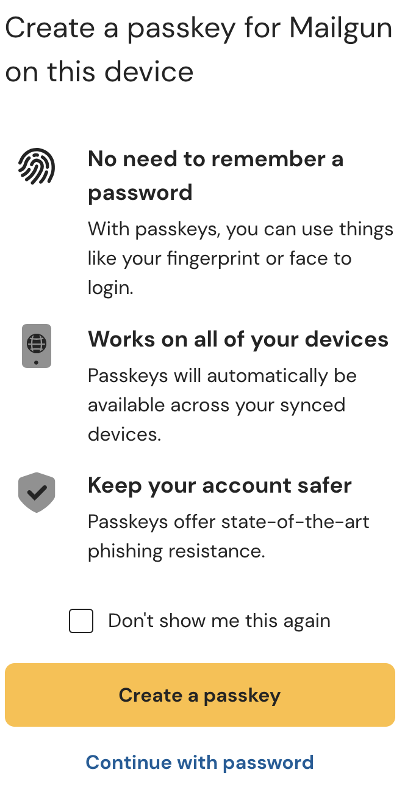
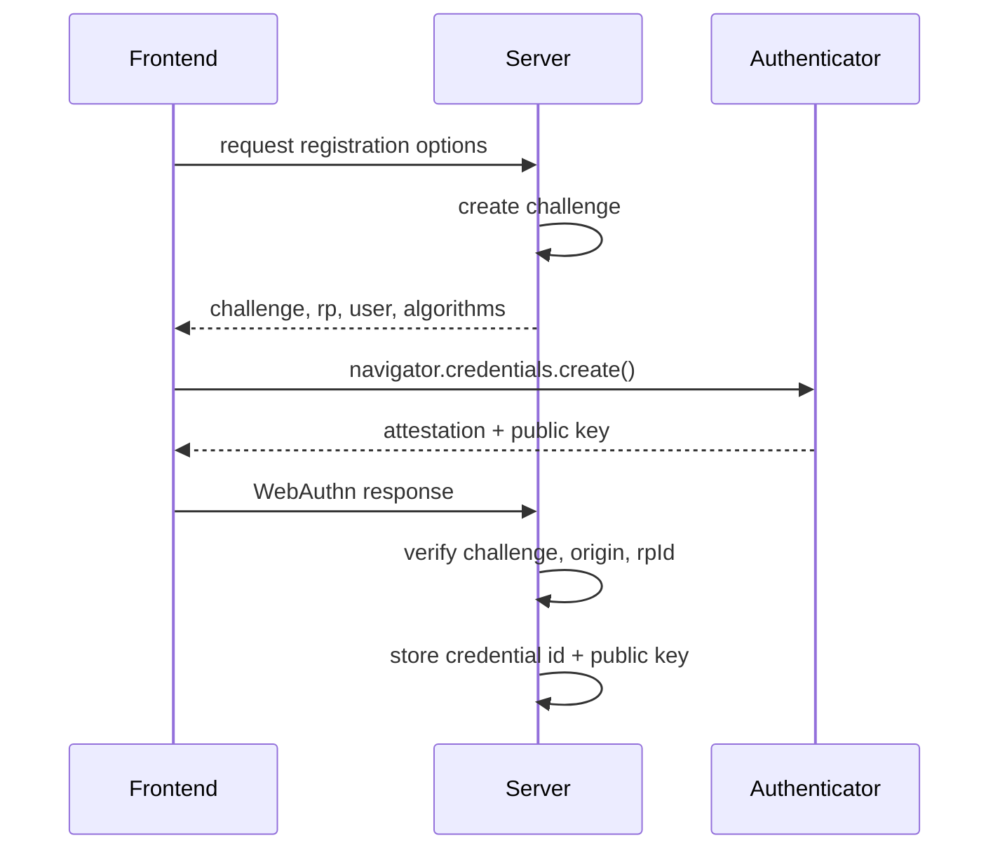
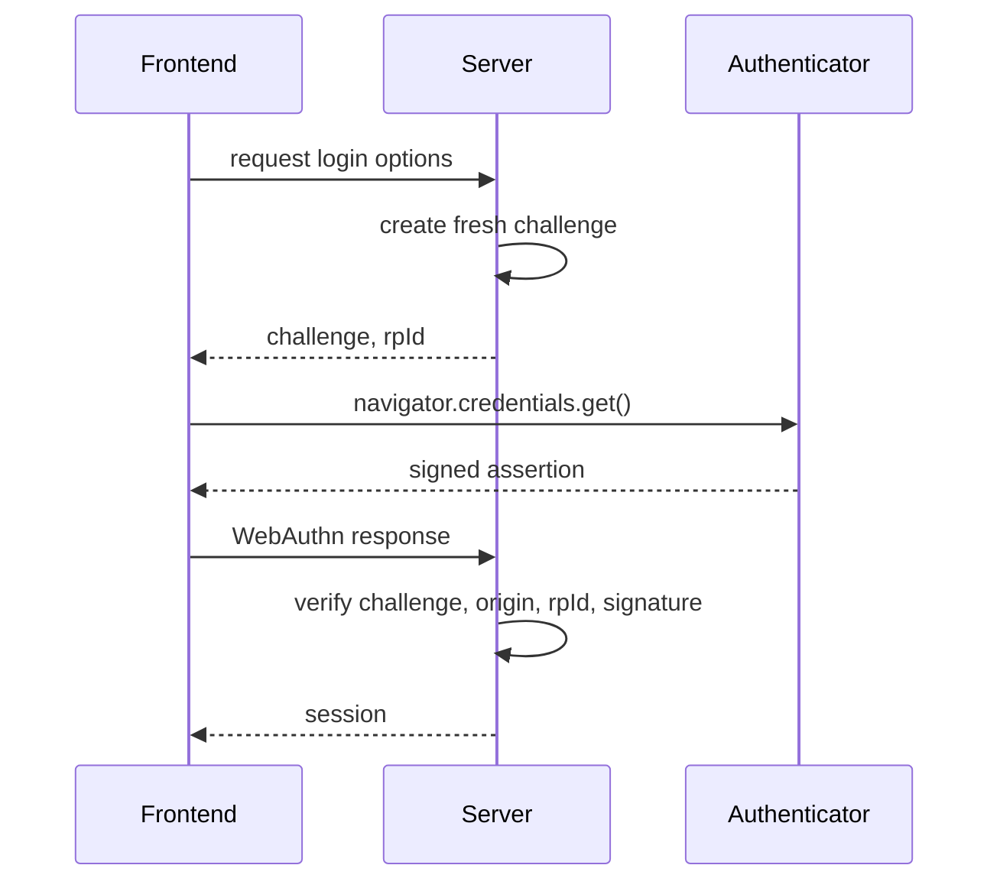

# Passkeys

## From shared secrets to cryptographic proof

<!--
Frame the talk as a change in security model, not as a new browser feature.
-->


---

<div style="display: flex; justify-content: center; align-items: center; height: 400px;">
  
</div>

<small style="display: block; text-align: center; margin-top: 1rem;">
  Example: Mailgun showing passkey sign-in
</small>


---
layout: statement
class: thesis-slide
---

# Passwords suck

---

# Signals from the real world

<div class="metric-grid">
  <div v-click>
    <strong>17.51B</strong>
    <span>pwned accounts tracked by Have I Been Pwned</span>
  </div>
  <div v-click>
    <strong>22%</strong>
    <span>of 2025 breaches used stolen credentials as an initial access vector</span>
  </div>
  <div v-click>
    <strong>37%</strong>
    <span>of cyberattacks use brute force</span>
  </div>
  <div v-click>
    <strong>123456</strong>
    <span>again topped NordPass global password findings in 2025</span>
  </div>
  <div v-click>
    <strong>94%</strong>
    <span>of passwords are used to access multiple accounts</span>
  </div>
</div>

<small v-click=5>
April 2026. Sources: Have I Been Pwned, Verizon DBIR 2025, Heimdal Security, NordPass 2025.
</small>

---

# How we tried to patch passwords

<v-clicks>

- <strong>Password complexity</strong>
  - Minimum length
  - Numbers
  - Symbols
  - Mixed case
- <strong>Multi-factor authentication</strong>
  - SMS or email OTP
  - Authenticator app
- <strong>Expiration</strong>
  - 30-day expiration
  - Cannot reuse the last 8 passwords
- <strong>Password managers</strong>

</v-clicks>

---
layout: statement
class: thesis-slide
---

<h1 class="green">Passwordless for usability<br />and security</h1>

--- 
layout: section
class: section-slide
---

# Passkeys

## A different way to prove sign-in

---

# What is a passkey?

<v-clicks>

- <strong>A safer sign-in method:</strong> You use your face, fingerprint, device PIN, or a security key instead of typing a password.
- <strong>Made for one website:</strong> A passkey belongs to the real app or website, so fake pages cannot reuse it.
- <strong>Nothing to remember:</strong> There is no secret phrase for the user to invent, forget, reuse, or paste into the wrong place.
- <strong>Works across devices:</strong> Modern platforms can sync passkeys, or you can keep them on a physical security key.

</v-clicks>

---
layout: statement
---

### For users, a passkey feels like unlocking the device.<br />For the service, it is a stronger way to know the right person is signing in.

---

# Where the standards meet

<div class="stack">
  <div>
    <strong>FIDO Alliance</strong>
    <span>FIDO2 and CTAP define the authenticator ecosystem.</span>
  </div>
  <div>
    <strong>W3C WebAuthn</strong>
    <span>The browser-facing API for public-key credentials.</span>
  </div>
  <div>
    <strong>Credential Management API</strong>
    <span><code>navigator.credentials</code> is the browser entry point.</span>
  </div>
  <div>
    <strong>Authenticators</strong>
    <span>Platform devices, password managers, phones, and roaming security keys.</span>
  </div>
</div>

WebAuthn became a W3C Recommendation in 2019. WebAuthn Level 3 is a W3C Candidate Recommendation Snapshot dated January 13, 2026.

<!--
  FIDO = Fast IDentity Online.
  CTAP = Client To Authenticator Protocol
-->

---
layout: section
class: section-slide
---

# Credential Management API

## A browser API for different credential models

---

# Credential Management API

```ts
navigator.credentials.create()
// create a new credential

navigator.credentials.get()
// request a credential

navigator.credentials.store()
// ask the user agent to store a credential

navigator.credentials.preventSilentAccess()
// signal sign-out and require user mediation next time
```

---

# Same container, different security models

| Credential story | Interface | What the server relies on |
| --- | --- | --- |
| Password* | `PasswordCredential` | A reusable secret |
| Federated identity* | `IdentityCredential`<br />`FederatedCredential` | An identity provider assertion |
| One-time password* | `OTPCredential` | A short-lived code |
| Web Authentication | `PublicKeyCredential` | A signature from a private key |


\* This feature is not Baseline because it does not work in some of the most widely used browsers.
---

# PasswordCredential

```ts
const credential = new PasswordCredential({
  id: "matteo@email.it",
  password: "123456",
  origin: "http://localhost:3000",
  name: "My beautiful todo app", // optional
});

await navigator.credentials.store(credential)

const saved = await navigator.credentials.get({
  password: true,
})
```

---
layout: statement
class: section-slide
---

# PasswordCredential demo

---
layout: section
class: section-slide
---

# PublicKeyCredential

---

# PublicKeyCredential

```ts
const credential = await navigator.credentials.create({
  publicKey: {
    challenge: new Uint8Array(16), // from the server
  },
})

// credential object
{
  "authenticatorAttachment": "platform",
  "clientExtensionResults": {},
  "id": "e0RdLXZASuAItwjOmaJejw",
  "rawId": "e0RdLXZASuAItwjOmaJejw",
  "response": {
      "attestationObject": "o2NmbXRkb...",
      "authenticatorData": "SZYN5YgOjGh0NBc...",
      "clientDataJSON": "eyJ0eXBlIjoi...",
      "publicKey": "MFkwEwYHKoZIzj...",
      "publicKeyAlgorithm": -7,
      "transports": [ "hybrid", "internal" ]
  },
  "type": "public-key"
}
```

---

# PublicKeyCredential

```ts
const credentials = await navigator.credentials.get({
  publicKey: {
    challenge: new Uint8Array(16), // from the server
  },
});

// send credentials.response to the server and verify the authenticatorData
```
---

# What the server never gets

<div class="never-grid">
  <div>Password</div>
  <div>Private key</div>
  <div>Biometric data</div>
</div>

The server stores verifiers and metadata, not the secret needed to sign in.

---

# Registration flow



---

# What the server stores

- User ID
- Credential ID
- Public key
- Algorithm
- Transports

The private key remains with the authenticator or passkey provider.

---

# Login flow



---
layout: statement
class: section-slide
---

# Passkey demo

---
layout: section
class: section-slide
---

# Authenticators

## What can hold and use keys

---

# Authenticator types

| Type | Examples |
| --- | --- |
| Platform | Touch ID, Face ID, Windows Hello, Android screen lock |
| Roaming | USB security key, NFC key, Bluetooth key |
| Hybrid | Phone used to sign in on another device |
| Synced passkey | Password manager or OS sync provider |
| Device-bound credential | One device or security key |

---

# PublicKeyCredentialCreationOptions

```ts
const publicKey: PublicKeyCredentialCreationOptions = {
  challenge,
  rp: {
    name: "Acme Bank",
    id: "acme.example",
  },
  user: {
    id: new Uint8Array([
      0x7a, 0x21, 0x4f, 0x8c, 0x12, 0x9b, 0x45, 0x03,
    ]),
    name: "ada@example.test",
    displayName: "Ada Lovelace",
  },
  pubKeyCredParams,
}
```

`rp` describes the relying party: the app or website that the passkey belongs to.

The `id` binds the credential to a domain, so a passkey created for one site cannot be replayed on another.

---

# PublicKeyCredentialCreationOptions

```ts
const publicKey: PublicKeyCredentialCreationOptions = {
  challenge,
  rp,
  user,
  pubKeyCredParams: [
    {
      type: "public-key",
      alg: -7, // ES256
    },
    {
      type: "public-key",
      alg: -257, // RS256
    },
  ]
}
```

This list tells the authenticator which public-key algorithms the server can verify.

The authenticator chooses one supported option, and the server stores the resulting public key with its algorithm.

---

# PublicKeyCredentialCreationOptions

```ts
const publicKey: PublicKeyCredentialCreationOptions = {
  challenge,
  rp,
  user,
  pubKeyCredParams,
  authenticatorSelection: {
    authenticatorAttachment: "platform",
    userVerification: "required",
    residentKey: "required",
  },
}
```

For passkeys, `residentKey` controls discoverable credentials, and `userVerification` asks for a local unlock such as biometrics, device PIN, or a security key PIN.


---
layout: section
class: section-slide
---

# Limits

## The authentication model improves; identity design still matters

---

# When to be careful

- **Shared accounts:** Passkeys are naturally personal.
- **Device access:** Some users lack updated or personal devices.
- **Enterprise controls:** Managed environments may restrict authenticators or sync providers.
- **Recovery:** Weak recovery can erase the security gain.
- **Fallback:** Password fallback must not become the attacker's path.
- **Transferability:** Passkeys are often tied to personal accounts or devices, and they are less portable than passwords.

---
layout: center
class: end-slide
---

# Thank you

---

# Sources

- [OWASP Top 10:2021 A07, Identification and Authentication Failures](https://owasp.org/Top10/2021/A07_2021-Identification_and_Authentication_Failures/)
- [Have I Been Pwned, Who's Been Pwned](https://haveibeenpwned.com/PwnedWebsites)
- [Password breach statistics in 2026](https://heimdalsecurity.com/blog/password-breach-statistics/)
- [Verizon 2025 Data Breach Investigations Report announcement](https://www.verizon.com/about/news/2025-data-breach-investigations-report)
- [NordPass Top 200 Most Common Passwords](https://nordpass.com/most-common-passwords-list/)
- [FIDO Alliance passkeys overview](https://fidoalliance.org/passkeys/)
- [W3C WebAuthn Level 3](https://www.w3.org/TR/webauthn-3/)
- [MDN Credential Management API](https://developer.mozilla.org/en-US/docs/Web/API/Credential_Management_API)
- [MDN Web Authentication API](https://developer.mozilla.org/en-US/docs/Web/API/Web_Authentication_API)
- [WebAuthn Guide](https://webauthn.guide/)
